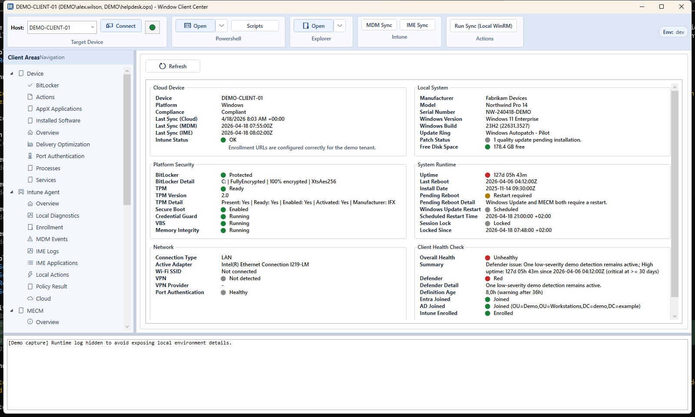
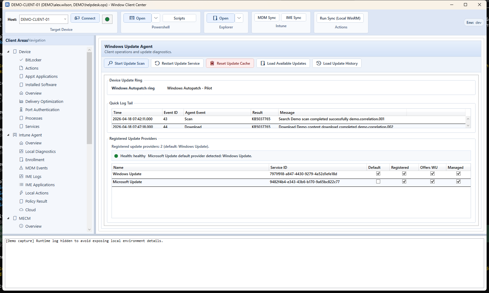
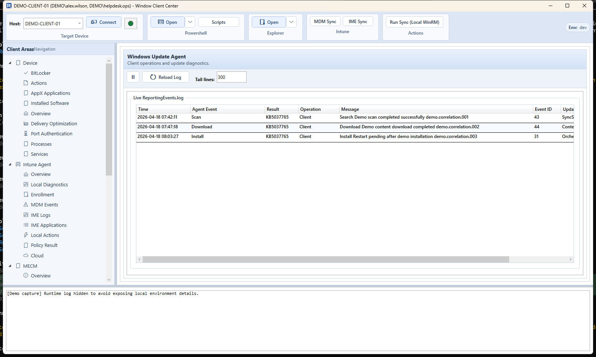
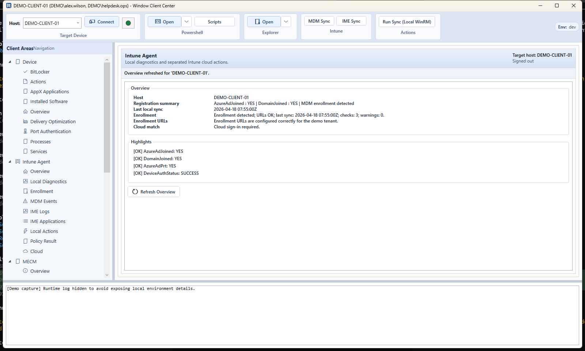

# Windows Client Center

Windows Client Center is a Windows desktop troubleshooting shell for Intune-managed devices that combines local diagnostics, WinRM-backed actions, Microsoft Graph-assisted workflows, and plugin-based tooling in one UI.

## Highlights

- Plugin-first WPF shell with persistent views and a familiar admin-focused layout
- Local device diagnostics for platform security, runtime state, networking, Defender, BitLocker, and delivery optimization
- Remote file and log workflows for Windows Update and `ReportingEvents.log`
- Local-first actions over WinRM for directly reachable clients
- Optional Microsoft Graph login for cloud-assisted lookup and sync scenarios

## Screenshots


Main shell overview with health, runtime, and network cards.


Windows Update Agent overview with update status, restart handling, and recent activity.


`ReportingEvents.log` live view for update-related troubleshooting.


Intune Agent view with enrollment, sync, and management context.

## Status

This public release is intentionally positioned as an active-development troubleshooting tool.

- `Mock` mode is the default public configuration and is the quickest way to explore the UI safely.
- `Demo` mode is available as an explicit opt-in and fills the core plugins with deterministic simulated data for walkthroughs, screenshots, and safe UI demos.
- `Live` mode is available for Microsoft Graph-backed sign-in and managed-device lookup when you provide your own tenant and client configuration.
- Cloud-triggered device actions are intentionally conservative in the public release. `sync` and `sync-now` are supported; other cloud actions stay local-first for now.

## Quick Start

### Requirements

- Windows 10/11
- .NET 8 SDK
- PowerShell 7 for the scripted runtime paths used by several plugins
- WinRM enabled if you want to target remote hosts from the UI

### Build

On Windows:

```powershell
dotnet restore WindowsClientCenter.sln
dotnet build src/Host.Wpf/Host.Wpf.csproj -c Debug
```

From WSL, use the repository wrapper:

```bash
./scripts/dotnet-win.sh build src/Host.Wpf/Host.Wpf.csproj -c Debug -clp:ErrorsOnly -nologo
```

### Run

```powershell
dotnet run --project src/Host.Wpf/Host.Wpf.csproj -c Debug
```

The tracked `appsettings.json` is public-safe and defaults to `Mock` mode. Create `src/Host.Wpf/appsettings.Local.json` for machine-specific overrides during development. Use `Demo` explicitly when you want a fully populated, screenshot-ready UI.

## Configuration

Configuration precedence is:

1. `src/Host.Wpf/appsettings.json`
2. optional `src/Host.Wpf/appsettings.Local.json`
3. `ICC_*` environment variables

Examples:

- `ICC_Intune__Mode=Demo`
- `ICC_Intune__Mode=Live`
- `ICC_Intune__TenantId=<your-tenant-id-or-domain>`
- `ICC_Intune__ClientId=<your-public-client-app-id>`

Additional details and a recommended local override template are in [docs/CONFIGURATION.md](docs/CONFIGURATION.md).

## Architecture

- `src/Host.Wpf`: WPF shell, composition root, navigation tree, ribbon, and host services
- `src/Plugin.Abstractions`: plugin contracts and shared models
- `src/Plugin.Host`: native plugin discovery, loading, and lifecycle
- `src/Intune.Services`: local runtime services plus mock/live Graph wiring
- `src/Plugins.*`: first-party plugins for device overview, actions, BitLocker, Intune, Defender, Windows Update, and PowerShell-driven workflows

## Packaging

Build the complete Windows release layout with:

```powershell
./build/package-layout.ps1 -Configuration Release
```

The script builds the plugins, publishes a self-contained multi-file
`win-x64` application pinned to .NET 8.0.29, verifies the required license
material, and writes both the binary ZIP and a corresponding LGPL source ZIP
below `artifacts/package/`.

## Developer Notes

- Public configuration guidance: [docs/CONFIGURATION.md](docs/CONFIGURATION.md)
- Plugin authoring notes: [docs/PLUGIN_DEVELOPMENT.md](docs/PLUGIN_DEVELOPMENT.md)
- IME log design notes: [docs/IME_LOG_DESIGN.md](docs/IME_LOG_DESIGN.md)
- Performance backlog: [docs/PERFORMANCE_OPTIMIZATION_TODO.md](docs/PERFORMANCE_OPTIMIZATION_TODO.md)
- Offline diagnostics backlog: [docs/OFFLINE_DIAGNOSTICS_TODO.md](docs/OFFLINE_DIAGNOSTICS_TODO.md)

The screenshot assets in `docs/images/` are exported by the running WPF application itself in screenshot mode:

```powershell
dotnet run --project src/Host.Wpf/Host.Wpf.csproj -c Debug -- --intune-mode Demo
```

Or export the public screenshots directly from the running WPF application in explicit demo mode:

```powershell
pwsh ./scripts/export-public-screenshots.ps1 -Configuration Debug
```

## Contributing And Security

- Contribution guide: [CONTRIBUTING.md](CONTRIBUTING.md)
- Security policy: [SECURITY.md](SECURITY.md)
- Code of conduct: [CODE_OF_CONDUCT.md](CODE_OF_CONDUCT.md)

## License

Windows Client Center is source-available under the [MIT License with the
Commons Clause License Condition v1.0](LICENSE). In practical terms:

- personal use and internal use in commercial organizations are permitted
- modifying and redistributing the software is permitted when all required
  license and attribution notices are retained
- selling the application itself, a substantially equivalent renamed or
  modified version, or a paid product or service whose value derives entirely
  or substantially from the application is not permitted
- separate commercial permission can only be granted by the applicable
  copyright holder

Because of the commercial restriction, this is a source-available license and
not an OSI-approved open-source license. Third-party components remain under
their own licenses; see the `Third-Party Components` section in [LICENSE](LICENSE),
[THIRD-PARTY-NOTICES.md](THIRD-PARTY-NOTICES.md), the full texts under
[LICENSES](LICENSES/), and the notices under
[docs/attribution](docs/attribution/).

Binary releases are self-contained, multi-file Windows packages. The
LGPL-covered `sccmclictr.automation.dll` deliberately remains a separate,
replaceable assembly. Release archives also contain the corresponding license
material, and the packaging process creates a separate LGPL source archive as
described in [SOURCE-CODE.md](SOURCE-CODE.md). Do not redistribute a binary ZIP
after removing those files or rebundle the LGPL assembly into an opaque
single-file executable.
