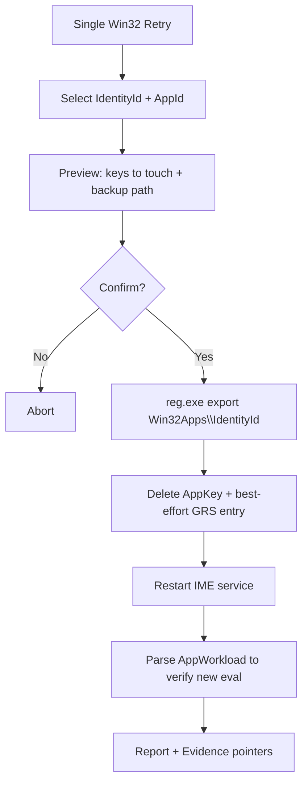
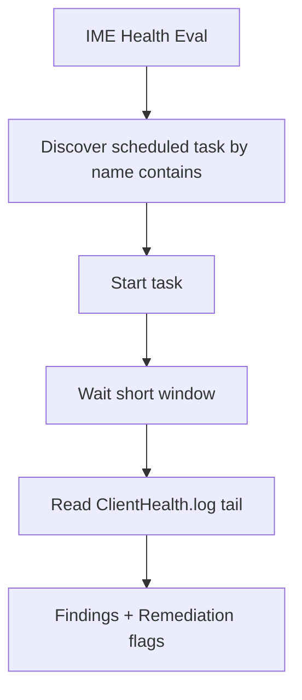

# Lokales Intune-Plugin für .NET 8 ohne Graph

## Executive Summary

Dieses Dokument spezifiziert ein **lokales Windows-Client-Center-Plugin** für eine **C# .NET 8 Anwendung (net8.0-windows)** ohne direkte Graph-/Intune-API-Aufrufe. Der Funktionsumfang basiert ausschließlich auf **lokalen Windows- und IME-Artefakten** (WinRT, Binaries, Services, Tasks, Registry, Event Logs, Dateien). Kernprinzip: **MDM und IME sind getrennte Engines**; “Remote Sync” (Intune Portal) triggert primär den MDM/OMA-DM‑Pfad und **weckt IME nicht zuverlässig**. citeturn3view3

Für eine robuste Umsetzung werden folgende Mechanismen priorisiert:

- **MDM Sync lokal** über **WinRT** `Windows.Management.MdmSessionManager.TryCreateSession()` + `StartAsync()` (offiziell dokumentiert; “check-in with the MDM server”). citeturn0search1turn0search10turn13search9  
- **MDM Diagnosereport lokal** über `mdmdiagnosticstool.exe -out <folder>` (oder `MdmDiagnosticsTool.exe -out`) zur Erzeugung von **MDMDiagReport.xml** und HTML-Report (Reportnamen variieren). citeturn1search4turn14search0  
- **IME Aktionen lokal** über URL‑Moniker `intunemanagementextension://syncapp` / `...://synccompliance`. citeturn0search0  
- **IME Diagnostik lokal** über Logpfad `C:\ProgramData\Microsoft\IntuneManagementExtension\Logs` und insbesondere `AppWorkload.log` (Microsoft schreibt es explizit als zentrales Win32‑App‑Troubleshooting‑Log). citeturn0search2  
- **Win32 App Retry** lokal über kontrollierte Registry‑Operationen (Backup → Delete AppKey + korrespondierender GRS‑Eintrag → IME Neustart). Details (GRS/24h‑Reevaluation) variieren nach IME‑Version und werden als “best effort” implementiert. citeturn4search3turn4search10  
- **Gesamtdiagnose-Bundle** lokal als ZIP aus: MDM Report + IME Logs + relevante EVTX‑Exports. citeturn0search2turn1search4  

## Feature-Liste und Priorisierung

Die Feature-Liste ist getrennt nach **MDM** (Windows OMA-DM) und **IME** (Intune Management Extension).

| Feature | Bereich | Prio | Admin | Netz | Nebenwirkungen / Risiken |
|---|---|---:|---:|---:|---|
| MDM Sync Now (WinRT) | MDM | P0 | nein* | ja | Startet Check-in; bei Netzproblemen Fehler in Eventlog; Enrollment-Auswahl ist nicht explizit steuerbar (“current enterprise account”). citeturn0search1turn0search10 |
| MDM Sync Status (Eventlog 208/209) | MDM | P0 | nein | nein | Nur Read; Logs können rotiert/leer sein. Beispiel-Event 208/209 in MS-Support-Threads. citeturn1search2 |
| MDM Diagnostic Report erzeugen (‑out) | MDM | P0 | optional | nein | Erzeugt Dateien; Reportname kann variieren; Laufzeit/Größe. citeturn1search4turn14search0 |
| MDM RSOP HTML/JSON (Parse MDMDiagReport.xml/html) | MDM | P0 | nein | nein | Parser muss Varianten berücksichtigen (`MDMDiagReport.html` vs `MDMDiagHTMLReport.html`). citeturn14search0 |
| EnterpriseMgmt Tasks inventarisieren (PushLaunch, …) | MDM | P1 | nein | nein | Tasknamen/Triggers variieren; Implementierung muss dynamisch discovern (`\Microsoft\Windows\EnterpriseMgmt\<EnrollmentId>`). citeturn3view2turn3view3 |
| IME Sync Apps/Win32/Scripts (`syncapp`) | IME | P0 | nein | ja | Handler benötigt oft interaktive Session; aus Service-Kontext ggf. nicht wirksam. citeturn0search0 |
| IME Sync Compliance (`synccompliance`) | IME | P1 | nein | ja | Wie oben; Compliance-getrieben. citeturn0search0 |
| IME Logs lesen/parsen (AppWorkload u. a.) | IME | P0 | nein | nein | Große Logs; Rotation. Microsoft nennt Pfad + AppWorkload als Kernlog. citeturn0search2 |
| IME Health Evaluation Run (Task/ClientHealthEval) | IME | P1 | ja | nein | Neustarts/Remediation möglich; Task läuft täglich mit Random Delay; Log `ClientHealth.log` im IME-Logpfad. citeturn3view0 |
| Win32: Retry Single App (Backup+Delete+IME restart) | IME | P0 | ja | ja | Hoher Impact; falscher Key kann unerwünschtes Redeploy auslösen; GRS-Key-Varianten möglich. citeturn4search3turn4search10 |
| Win32: Retry All Failed Apps (Batch + Rate-Limit) | IME | P1 | ja | ja | Flooding-Risiko; zwingend Preview + Cap; GRS/24h Mechanik beachten. citeturn4search3 |
| Create Diagnostics Bundle (ZIP) | Support | P0 | optional | nein | Sensible Inhalte; Sanitization/Redaction nötig; Größe. citeturn0search2turn1search4 |

\* In der Praxis ist “Admin” für WinRT‑Start oft nicht nötig, aber abhängig vom Geräte-/Account-Kontext; robust implementieren: “works best as same user who can click Sync in Settings”. WinRT‑API ist offiziell, aber beschreibt keinen Enrollment‑Selector. citeturn0search1turn13search9

## Aktionen, lokale Mechanismen und lauffähige Snippets

Die folgenden Actions sind **implementierbar ohne Graph**. Die **vollständigen JSON‑Specs pro Action** (inkl. Preconditions/Postconditions/Rollback/Evidence) stehen im **ZIP‑Manifest** am Ende.

**Gemeinsame Evidenzquellen (für EvidenceCollector)**
- **MDM Eventlogs**: `Microsoft-Windows-DeviceManagement-Enterprise-Diagnostics-Provider/Admin` (u. a. Session Start/End, Beispiel-Events 208/209). citeturn1search2  
- **IME Logs**: `C:\ProgramData\Microsoft\IntuneManagementExtension\Logs`, plus `AppWorkload.log` für Win32‑App‑Events. citeturn0search2  
- **MDM Diagnostics Report**: output folder enthält `MDMDiagReport.xml` und HTML (Name kann `MDMDiagReport.html` oder `MDMDiagHTMLReport.html` sein; IntuneDebug implementiert Fallback). citeturn1search4turn14search0  
- **EnterpriseMgmt Tasks**: Task-Scheduler-Pfad `Microsoft → Windows → EnterpriseMgmt → <EnrollmentId>` (GUID ist Enrollment ID). citeturn3view2  
- **IME Health Evaluation**: Scheduled Task startet `C:\Program Files (x86)\Microsoft Intune Management Extension\ClientHealthEval.exe`, Log `ClientHealth.log` im IME Logverzeichnis. citeturn3view0  

image_group{"layout":"carousel","aspect_ratio":"16:9","query":["MDMDiagReport.html enrolled configuration and target resources screenshot","Task Scheduler EnterpriseMgmt PushLaunch task screenshot","Intune Management Extension AppWorkload.log CMTrace screenshot","Intune Management Extension Health Evaluation scheduled task ClientHealthEval.exe screenshot"],"num_per_query":1}

### Action MDM Sync Now (WinRT)

**Mechanismus**
- WinRT: `Windows.Management.MdmSessionManager.TryCreateSession()` → `MdmSession.StartAsync()` (StartAsync: “check-in with the MDM server”). citeturn0search1turn0search10turn13search9  

**C# (.NET 8, net8.0-windows)**
```csharp
using System;
using System.Threading.Tasks;
using Windows.Management;

public static class MdmSyncNow
{
    public static async Task RunAsync()
    {
        var session = MdmSessionManager.TryCreateSession();
        if (session is null)
            throw new InvalidOperationException("No MDM session available (device not enrolled / no enterprise account).");

        await session.StartAsync(); // MDM check-in
    }
}
```
citeturn0search1turn0search10  

**PowerShell**
```powershell
[Windows.Management.MdmSessionManager,Windows.Management,ContentType=WindowsRuntime] | Out-Null
$session = [Windows.Management.MdmSessionManager]::TryCreateSession()
if ($null -eq $session) { throw "No MDM session available." }
$session.StartAsync() | Out-Null
```
(entspricht dem bekannten WinRT‑Ansatz, u. a. in OofHours beschrieben). citeturn2search6turn0search10  

**Berechtigungen / Edge-Cases**
- **Fehlerfall**: `TryCreateSession()` liefert `null` → Gerät nicht (voll) enrolled. citeturn0search1  
- **Netz**: Ohne erreichbaren MDM‑Server endet Session mit Fehlerstatus; Status ist in Event 209 enthalten (Beispiel `0x80072f78`). citeturn1search2  
- **Nebenwirkung**: Löst nur MDM/OMA-DM‑Pfad aus; IME wird dadurch nicht garantiert getriggert. citeturn3view3  

### Action MDM Sync Status lesen (Eventlog 208/209)

**Mechanismus**
- Provider/Channel: `Microsoft-Windows-DeviceManagement-Enterprise-Diagnostics-Provider/Admin`  
- IDs: 208 (Session started), 209 (Session ended) in Support-Beispielen. citeturn1search2  

**C#**
```csharp
using System;
using System.Collections.Generic;
using System.Diagnostics.Eventing.Reader;

public static class MdmSyncStatus
{
    public static IEnumerable<(DateTime time, int id, string message)> GetLatest(int max = 50)
    {
        var logName = "Microsoft-Windows-DeviceManagement-Enterprise-Diagnostics-Provider/Admin";
        var xpath = "*[System[(EventID=208 or EventID=209)]]";
        var query = new EventLogQuery(logName, PathType.LogName, xpath) { ReverseDirection = true };

        using var reader = new EventLogReader(query);
        for (int i = 0; i < max; i++)
        {
            using var evt = reader.ReadEvent();
            if (evt is null) yield break;
            yield return (evt.TimeCreated ?? DateTime.MinValue, evt.Id, evt.FormatDescription() ?? "");
        }
    }
}
```
citeturn1search2  

**PowerShell**
```powershell
Get-WinEvent -LogName "Microsoft-Windows-DeviceManagement-Enterprise-Diagnostics-Provider/Admin" -MaxEvents 200 |
  Where-Object { $_.Id -in 208,209 } |
  Select-Object TimeCreated, Id, Message
```

**Edge-Cases**
- Channel kann fehlen/disabled sein → als Finding (nicht crashen).  
- Eventtext enthält Win32‑Code (z. B. `0x80072f78`) → Regex extrahieren, als “LastSyncResult” speichern. citeturn1search2  

### Action MDM Diagnostics Report erzeugen (‑out)

**Mechanismus**
- `mdmdiagnosticstool.exe -out c:\temp` ist als clientseitige Troubleshooting‑Option dokumentiert (erzeugt `MDMDiagReport.html`). citeturn1search4  
- IntuneDebug/IntuneDebug‑Reportlogik setzt in der Praxis auf erzeugte `MDMDiagReport.xml`/HTML und implementiert filename‑Fallback (`MDMDiagHTMLReport.html`). citeturn14search0  

**C# (ProcessRunner‑Nutzung; Dateiname robust)**
```csharp
using System;
using System.IO;
using System.Threading;
using System.Threading.Tasks;

public static class MdmDiagnostics
{
    public static async Task<string> GenerateOutAsync(ProcessRunner runner, string outDir, CancellationToken ct)
    {
        Directory.CreateDirectory(outDir);

        // Toolname variiert: mdmdiagnosticstool.exe / MdmDiagnosticsTool.exe
        var system32 = Environment.GetFolderPath(Environment.SpecialFolder.System);
        var toolCandidates = new[]
        {
            Path.Combine(system32, "MdmDiagnosticsTool.exe"),
            Path.Combine(system32, "mdmdiagnosticstool.exe")
        };

        string? tool = null;
        foreach (var c in toolCandidates)
            if (File.Exists(c)) { tool = c; break; }

        if (tool is null)
            throw new FileNotFoundException("MDM diagnostics tool not found in System32.", toolCandidates[0]);

        var args = $"-out \"{outDir}\"";
        var result = await runner.RunAsync(tool, args, TimeSpan.FromMinutes(5), ct);
        if (result.ExitCode != 0)
            throw new InvalidOperationException($"Diagnostics tool failed (exit={result.ExitCode}). stderr={result.Stderr}");

        return outDir;
    }

    public static (string xml, string html) ResolveReportFiles(string outDir)
    {
        var xml = Path.Combine(outDir, "MDMDiagReport.xml");
        if (!File.Exists(xml))
            throw new FileNotFoundException("MDMDiagReport.xml not found", xml);

        var html1 = Path.Combine(outDir, "MDMDiagReport.html");
        var html2 = Path.Combine(outDir, "MDMDiagHTMLReport.html"); // fallback wie IntuneDebug
        var html = File.Exists(html1) ? html1 : (File.Exists(html2) ? html2 : throw new FileNotFoundException("No HTML report found.", html1));

        return (xml, html);
    }
}
```
citeturn1search4turn14search0  

**PowerShell**
```powershell
$dir = "$env:PUBLIC\Documents\MDMDiagnostics\$(Get-Date -Format yyyy-MM-dd_HH-mm-ss)"
New-Item -ItemType Directory -Path $dir -Force | Out-Null
& "$env:WINDIR\System32\mdmdiagnosticstool.exe" -out $dir
```
citeturn1search4  

**Edge-Cases**
- Report erzeugt HTML, aber XML fehlt (OS/Param‑Variante) → Tool meldet “partial report” statt Hard‑Fail.  
- Disk‑Space: Bundle‑Collector muss Limits/FreeSpace checken.

### Action EnterpriseMgmt Tasks inventarisieren (Discovery, nicht “Trigger”)

**Warum wichtig**
- Remote Sync arbeitet über Push → `PushLaunch` → `deviceenroller.exe` → geplante Tasks → `omadmclient`. IME ist in diesem Flow **nicht enthalten**. citeturn3view3  
- Tasks liegen in `Microsoft → Windows → EnterpriseMgmt → <guid>` (Enrollment ID). citeturn3view2  

**C# (COM TaskScheduler, dynamische Discovery)**
```csharp
using System;
using System.Collections.Generic;

public static class EnterpriseMgmtTasks
{
    public static IEnumerable<(string path, string name, string? xml)> Enumerate()
    {
        dynamic service = Activator.CreateInstance(Type.GetTypeFromProgID("Schedule.Service")!)!;
        service.Connect();

        dynamic root = service.GetFolder("\\Microsoft\\Windows\\EnterpriseMgmt");
        foreach (dynamic sub in root.GetFolders(0))
        {
            string folderPath = sub.Path; // e.g. \Microsoft\Windows\EnterpriseMgmt\{EnrollmentId}
            foreach (dynamic task in sub.GetTasks(0))
                yield return (task.Path, task.Name, task.Xml as string);
        }
    }
}
```
(Spezifikation: Pfadstruktur `EnterpriseMgmt\<guid>` ist beschrieben.) citeturn3view2  

**Edge-Cases**
- Folder fehlt → Gerät nicht MDM‑enrolled oder Policies entfernen Tasks.  
- Task-XML kann WNF‑Trigger enthalten (z. B. bei PushLaunch); das darfst du **nur lesen**, nicht blind kopieren. (PatchMyPC beschreibt WNF‑Trigger‑Kopplung detailliert.) citeturn3view3  

### Action IME Sync auslösen (Apps / Compliance)

**Mechanismus**
- URL‑Moniker: `intunemanagementextension://syncapp` / `intunemanagementextension://synccompliance` (verified in IME log; bekanntes Vorgehen). citeturn0search0  

**C#**
```csharp
using System.Diagnostics;

public static class ImeSync
{
    public static void SyncApps()
        => Process.Start(new ProcessStartInfo { FileName = "intunemanagementextension://syncapp", UseShellExecute = true });

    public static void SyncCompliance()
        => Process.Start(new ProcessStartInfo { FileName = "intunemanagementextension://synccompliance", UseShellExecute = true });
}
```
citeturn0search0  

**PowerShell**
```powershell
(New-Object -ComObject Shell.Application).Open("intunemanagementextension://syncapp")
# oder:
(New-Object -ComObject Shell.Application).Open("intunemanagementextension://synccompliance")
```
citeturn0search0  

**Edge-Cases / Fehlerbilder**
- `Win32Exception` (“file not found”) → Handler nicht registriert / IME nicht installiert. IME‑Logpfad ist Microsoft-dokumentiert; existence-check ist valide. citeturn0search2  
- Kein interaktiver User → Moniker kann wirkungslos sein; Result muss “signal sent” vs “IME ack” trennen (IME ack nur über Log-Evidence).

### Action IME Logs parsen (Win32 Policies aus AppWorkload)

**Mechanismus**
- IME Logs liegen typischerweise unter `C:\ProgramData\Microsoft\IntuneManagementExtension\Logs`; Microsoft empfiehlt `AppWorkload.log` zur Analyse der Win32‑App‑Events. citeturn0search2  
- IntuneDebug extrahiert Win32 Policies über Regex `<![LOG[Get policies = ...]LOG]!>` aus `AppWorkload*.log`. citeturn14search2  

**C# (minimal, offline, GUIDs bleiben GUIDs)**
```csharp
using System;
using System.IO;
using System.Linq;
using System.Text.Json;
using System.Text.RegularExpressions;

public static class AppWorkloadPolicyParser
{
    private static readonly Regex Rx = new(
        @"<!\[LOG\[Get policies = (?<json>\[\{.*?\}\])\]LOG\]!>",
        RegexOptions.Compiled);

    public static JsonElement? TryGetLatestPolicyArray(string logDir)
    {
        var files = Directory.Exists(logDir)
            ? new DirectoryInfo(logDir).GetFiles("AppWorkload*.log").OrderByDescending(f => f.LastWriteTimeUtc)
            : Enumerable.Empty<FileInfo>();

        foreach (var f in files)
        {
            foreach (var line in File.ReadLines(f.FullName))
            {
                var m = Rx.Match(line);
                if (!m.Success) continue;

                using var doc = JsonDocument.Parse(m.Groups["json"].Value);
                return doc.RootElement.Clone(); // array of policy objects
            }
        }
        return null;
    }
}
```
citeturn0search2turn14search2  

### Action IME Health Evaluation starten und auswerten

**Mechanismus**
- Scheduled Task “Intune Management Extension Health Evaluation” wird bei IME‑Installation erstellt und startet `ClientHealthEval.exe`. Logfile `ClientHealth.log` liegt im IME‑Logverzeichnis. citeturn3view0  

**C# (Task Start via schtasks.exe – robust, keine weitere Dependency)**
```csharp
using System;
using System.IO;
using System.Threading;
using System.Threading.Tasks;

public static class ImeHealthEval
{
    public static async Task RunAsync(ProcessRunner runner, CancellationToken ct)
    {
        // Name kann lokalisiert/variieren; implementiere Discovery:
        // 1) "schtasks /Query /FO LIST /V" filtern oder COM TaskScheduler nach Name contains.
        // Hier: schtasks-Variante mit "contains" ist TODO.

        // Placeholder: Nutzer muss exakten TaskName liefern (in Action params).
        throw new NotImplementedException("Implement task discovery by enumerating Task Scheduler and matching task name contains 'Intune Management Extension Health Evaluation'.");
    }

    public static string? TryReadClientHealthTail(string logDir, int lines = 100)
    {
        var path = Path.Combine(logDir, "ClientHealth.log");
        if (!File.Exists(path)) return null;
        var all = File.ReadAllLines(path);
        return string.Join(Environment.NewLine, all[^Math.Min(lines, all.Length)..]);
    }
}
```
Task/Binary/Log-Pfade sind konkret beschrieben. citeturn3view0  

### Action Win32 App Retry (Single / All Failed)

**Mechanismus (lokal, ohne Graph)**
- IME nutzt eine **Global Re-evaluation Schedule (GRS)**; “Failed” Win32 Apps werden typischerweise nach ca. **24 Stunden** erneut evaluiert (Quelle: Call4Cloud). citeturn4search3  
- Microsoft Support‑Antworten und Community‑Guides nennen: **AppId‑Key + korrespondierender GRS‑Key** unter `HKLM\SOFTWARE\Microsoft\IntuneManagementExtension\Win32Apps` löschen, um Reinstall/Retry zu erzwingen. citeturn4search10  
- **Wichtig:** Exakte Key-/GRS‑Varianten können zwischen IME‑Versionen variieren; implementiere **Discovery + Preview** (nicht hardcoden).

**C# Registry‑Backup + Delete (kompakt, lauffähig)**
```csharp
using Microsoft.Win32;
using System;
using System.IO;
using System.Threading;
using System.Threading.Tasks;

public static class Win32Retry
{
    public static async Task BackupAndDeleteAsync(
        ProcessRunner runner,
        string identityId, Guid appId,
        string backupDir,
        bool whatIf,
        CancellationToken ct)
    {
        var baseKey = $@"SOFTWARE\Microsoft\IntuneManagementExtension\Win32Apps\{identityId}";
        var appKey  = $@"{baseKey}\{appId:D}";
        var grsRoot = $@"{baseKey}\GRS";

        // 1) Backup via reg.exe export (einfach & robust)
        Directory.CreateDirectory(backupDir);
        var regExport = Path.Combine(backupDir, $"Win32Apps_{Sanitize(identityId)}.reg");
        var result = await runner.RunAsync(
            "reg.exe",
            $"export \"HKLM\\{baseKey}\" \"{regExport}\" /y",
            TimeSpan.FromSeconds(30),
            ct);

        if (result.ExitCode != 0)
            throw new InvalidOperationException($"reg export failed (exit={result.ExitCode}): {result.Stderr}");

        // 2) Preview / existence checks
        using var lm = Registry.LocalMachine;
        if (lm.OpenSubKey(appKey) is null)
            throw new InvalidOperationException($"App key not found: HKLM\\{appKey}");

        if (whatIf) return;

        // 3) Delete App key
        DeleteTree(lm, appKey);

        // 4) Best-effort: delete GRS entries that contain appId (Implementation detail varies!)
        // NOTE: This is intentionally conservative; expand via log-driven discovery (GRSManager/Hash) later.
        using var grs = lm.OpenSubKey(grsRoot, writable: true);
        if (grs is not null)
        {
            foreach (var sub in grs.GetSubKeyNames())
                if (sub.Contains(appId.ToString("D"), StringComparison.OrdinalIgnoreCase))
                    grs.DeleteSubKeyTree(sub, throwOnMissingSubKey: false);
        }

        // 5) IME restart is separate action (safer for batching).
    }

    private static void DeleteTree(RegistryKey root, string subKeyPath)
    {
        var parentPath = Path.GetDirectoryName(subKeyPath)?.Replace('/', '\\');
        var name = Path.GetFileName(subKeyPath);
        using var parent = string.IsNullOrWhiteSpace(parentPath) ? root : root.OpenSubKey(parentPath, writable: true);
        if (parent is null) throw new InvalidOperationException("Parent key missing");
        parent.DeleteSubKeyTree(name, throwOnMissingSubKey: false);
    }

    private static string Sanitize(string s) => string.Join("_", s.Split(Path.GetInvalidFileNameChars()));
}
```
(Registry‑Location und Delete‑Ansatz sind als gängige Methode beschrieben; Details variieren → daher best‑effort + Preview). citeturn4search10turn4search3  

**PowerShell (Preview‑orientiert)**
```powershell
$identity = "<IdentityId>"
$appId    = "<AppGuid>"

$base = "HKLM:\SOFTWARE\Microsoft\IntuneManagementExtension\Win32Apps\$identity"
$app  = Join-Path $base $appId

if (!(Test-Path $app)) { throw "App key missing: $app" }

$backup = "$env:ProgramData\WindowsClientCenter\Backup\$(Get-Date -Format yyyyMMdd_HHmmss)"
New-Item -ItemType Directory -Path $backup -Force | Out-Null
reg.exe export "HKLM\SOFTWARE\Microsoft\IntuneManagementExtension\Win32Apps\$identity" "$backup\Win32Apps_$identity.reg" /y | Out-Null

# Remove-Item $app -Recurse -Force  # erst nach Preview/Confirm
```
citeturn4search10  

**Benötigte Berechtigungen / Nebenwirkungen**
- Admin erforderlich (HKLM‑Writes, Service restart).  
- Nebenwirkung: App wird als “neu zu evaluieren” behandelt; kann Download/Install sofort auslösen (bei Netz). GRS‑Mechanik und Retry‑Intervalle sind dokumentiert (Call4Cloud). citeturn4search3  

## Action-Engine Stubs und Projektstruktur

### Projekt-Setup für WinRT und Windows‑APIs

- Microsoft empfiehlt für Desktop‑Apps die Einrichtung zur Nutzung von WinRT‑APIs; unter anderem kann `Microsoft.Windows.SDK.Contracts` eingesetzt werden. citeturn13search1turn13search4turn13search0  

**Beispiel `Plugin.Core.csproj` (minimal)**
```xml
<Project Sdk="Microsoft.NET.Sdk">
  <PropertyGroup>
    <TargetFramework>net8.0-windows10.0.19041.0</TargetFramework>
    <Nullable>enable</Nullable>
    <ImplicitUsings>enable</ImplicitUsings>
  </PropertyGroup>

  <ItemGroup>
    <!-- WinRT API Pack -->
    <PackageReference Include="Microsoft.Windows.SDK.Contracts" Version="10.0.26100.7705" />
  </ItemGroup>
</Project>
```
citeturn13search0turn13search1  

### Code-Stub-Struktur (für Codex)

Empfohlene Struktur (Paths werden im Manifest referenziert):

```
src/
  WindowsClientCenter.Cli/
  WindowsClientCenter.Core/
    Actions/
    Infrastructure/
  WindowsClientCenter.ElevatedWorker/
tests/
  WindowsClientCenter.Core.Tests/
snippets/
  cs/
  ps/
```

### Lauffähige Stubs

**ActionSpec / Request / Result**
```csharp
using System;
using System.Collections.Generic;

public sealed record ActionSpec(
    string Id,
    string Name,
    string Category,
    string Priority,
    bool RequiredElevation,
    int TimeoutSeconds,
    IReadOnlyDictionary<string, string> Params // paramName -> type (string/guid/int/bool/path)
);

public sealed record ActionRequest(
    string Id,
    IReadOnlyDictionary<string, object?> Params
);

public sealed record ActionResult(
    string Id,
    bool Success,
    int? ExitCode,
    string? Error,
    IReadOnlyList<string> Warnings,
    IReadOnlyDictionary<string, string> Evidence // key -> path or pointer
);
```

**ProcessRunner**
```csharp
using System;
using System.Diagnostics;
using System.Threading;
using System.Threading.Tasks;

public sealed record ProcessRunResult(int ExitCode, string Stdout, string Stderr);

public sealed class ProcessRunner
{
    public async Task<ProcessRunResult> RunAsync(string fileName, string args, TimeSpan timeout, CancellationToken ct)
    {
        using var p = new Process
        {
            StartInfo = new ProcessStartInfo
            {
                FileName = fileName,
                Arguments = args,
                UseShellExecute = false,
                RedirectStandardOutput = true,
                RedirectStandardError = true,
                CreateNoWindow = true
            }
        };

        if (!p.Start())
            throw new InvalidOperationException($"Failed to start: {fileName}");

        var stdoutTask = p.StandardOutput.ReadToEndAsync();
        var stderrTask = p.StandardError.ReadToEndAsync();

        using var timeoutCts = CancellationTokenSource.CreateLinkedTokenSource(ct);
        timeoutCts.CancelAfter(timeout);

        try
        {
            await p.WaitForExitAsync(timeoutCts.Token);
        }
        catch (OperationCanceledException)
        {
            try { if (!p.HasExited) p.Kill(entireProcessTree: true); } catch { /* ignore */ }
            throw new TimeoutException($"Process timeout: {fileName} {args}");
        }

        return new ProcessRunResult(p.ExitCode, await stdoutTask, await stderrTask);
    }
}
```

**ElevationHelper (2‑Process‑Pattern)**
```csharp
using System;
using System.Diagnostics;
using System.Security.Principal;

public static class ElevationHelper
{
    public static bool IsElevated()
    {
        using var id = WindowsIdentity.GetCurrent();
        var principal = new WindowsPrincipal(id);
        return principal.IsInRole(WindowsBuiltInRole.Administrator);
    }

    public static int RelaunchElevated(string exePath, string arguments)
    {
        var psi = new ProcessStartInfo
        {
            FileName = exePath,
            Arguments = arguments,
            UseShellExecute = true,
            Verb = "runas" // UAC prompt
        };
        using var p = Process.Start(psi);
        if (p is null) throw new InvalidOperationException("Failed to start elevated process.");
        p.WaitForExit();
        return p.ExitCode;
    }
}
```

**WinRTWrapper (MDM Sync)**
```csharp
using System;
using System.Threading.Tasks;
using Windows.Management;

public static class WinRtWrapper
{
    public static async Task MdmSyncNowAsync()
    {
        var session = MdmSessionManager.TryCreateSession();
        if (session is null)
            throw new InvalidOperationException("No MDM session available.");

        await session.StartAsync();
    }
}
```
citeturn0search1turn0search10  

**EvidenceCollector (IME Logs + MDM report + EVTX)**
```csharp
using System;
using System.IO;
using System.IO.Compression;
using System.Threading;
using System.Threading.Tasks;

public sealed class EvidenceCollector
{
    private readonly ProcessRunner _runner;
    public EvidenceCollector(ProcessRunner runner) => _runner = runner;

    public async Task<string> CreateBundleZipAsync(string bundleRoot, string zipPath, CancellationToken ct)
    {
        Directory.CreateDirectory(bundleRoot);

        // IME logs (Microsoft-dokumentierter Pfad)
        var imeSrc = @"C:\ProgramData\Microsoft\IntuneManagementExtension\Logs";
        var imeDst = Path.Combine(bundleRoot, "IME_Logs");
        if (Directory.Exists(imeSrc))
            CopyDirectory(imeSrc, imeDst);

        // MDM Admin EVTX
        var evtx = Path.Combine(bundleRoot, "MDM_Admin.evtx");
        await _runner.RunAsync("wevtutil.exe",
            $"epl \"Microsoft-Windows-DeviceManagement-Enterprise-Diagnostics-Provider/Admin\" \"{evtx}\"",
            TimeSpan.FromSeconds(30), ct);

        // ZIP
        if (File.Exists(zipPath)) File.Delete(zipPath);
        ZipFile.CreateFromDirectory(bundleRoot, zipPath, CompressionLevel.Fastest, includeBaseDirectory: false);
        return zipPath;
    }

    private static void CopyDirectory(string src, string dst)
    {
        Directory.CreateDirectory(dst);
        foreach (var f in Directory.GetFiles(src))
            File.Copy(f, Path.Combine(dst, Path.GetFileName(f)), overwrite: true);
        foreach (var d in Directory.GetDirectories(src))
            CopyDirectory(d, Path.Combine(dst, Path.GetFileName(d)));
    }
}
```
IME Logpfad ist Microsoft-dokumentiert. citeturn0search2  

**ActionExecutor (Dispatch + Elevation Gate)**
```csharp
using System;
using System.Collections.Generic;
using System.Threading;
using System.Threading.Tasks;

public sealed class ActionExecutor
{
    private readonly ProcessRunner _runner = new();
    private readonly EvidenceCollector _evidence;

    public ActionExecutor() => _evidence = new EvidenceCollector(_runner);

    public async Task<ActionResult> ExecuteAsync(ActionSpec spec, ActionRequest req, CancellationToken ct)
    {
        if (spec.RequiredElevation && !ElevationHelper.IsElevated())
        {
            // In echt: serialize req to temp json and pass pointer
            return new ActionResult(spec.Id, false, null,
                "Elevation required. Use ElevatedWorker pattern.", new List<string>(), new Dictionary<string, string>());
        }

        try
        {
            return spec.Id switch
            {
                "A01_MDM_SYNC_NOW" => await Run_MdmSyncNow(ct),
                "A12_SUPPORT_CREATE_BUNDLE" => await Run_CreateBundle(req, ct),
                _ => new ActionResult(spec.Id, false, null, "Unknown action id.", Array.Empty<string>(), new Dictionary<string, string>())
            };
        }
        catch (Exception ex)
        {
            return new ActionResult(spec.Id, false, null, ex.Message, Array.Empty<string>(), new Dictionary<string, string>());
        }
    }

    private static async Task<ActionResult> Run_MdmSyncNow(CancellationToken ct)
    {
        await WinRtWrapper.MdmSyncNowAsync();
        return new ActionResult("A01_MDM_SYNC_NOW", true, 0, null, Array.Empty<string>(), new Dictionary<string, string>());
    }

    private async Task<ActionResult> Run_CreateBundle(ActionRequest req, CancellationToken ct)
    {
        var root = (string)(req.Params["bundleRoot"] ?? throw new ArgumentException("bundleRoot missing"));
        var zip  = (string)(req.Params["zipPath"] ?? throw new ArgumentException("zipPath missing"));

        var outZip = await _evidence.CreateBundleZipAsync(root, zip, ct);
        return new ActionResult("A12_SUPPORT_CREATE_BUNDLE", true, 0, null, Array.Empty<string>(),
            new Dictionary<string, string> { ["bundleZip"] = outZip });
    }
}
```

## Mermaid-Workflows



```mermaid
flowchart TD
  S[Retry all failed Win32 Apps] --> E[Build failure list from StatusServiceReports + logs]
  E --> L[Apply caps: maxAppsPerRun + cooldown]
  L --> P[Preview list]
  P --> C{Confirm?}
  C -- No --> X[Abort]
  C -- Yes --> B[Backup per IdentityId]
  B --> D[Delete per app (no restart per app)]
  D --> R[Restart IME once]
  R --> Z[Summary.json + Evidence]
```



```mermaid
flowchart TD
  S[Create Diagnostics Bundle] --> M[Generate MDM report -out]
  M --> I[Copy IME Logs folder]
  I --> E[Export MDM Admin EVTX]
  E --> O[Write summary.json (optional)]
  O --> Z[Zip bundle + return path]
```

## OSS-Tools und Wiederverwendbarkeit

| Tool | Relevanz | Wiederverwendbar ohne Graph | Lizenz | Integrationsaufwand |
|---|---|---:|---|---|
| IntuneDebug (gpresult‑like / Get‑MDMPolicyReport) | Referenzparser für MDMDiagReport + IME Logs (Regex, HTML‑Fallback) citeturn14search0turn14search2turn14search5 | ja (offline) | MIT (Repo) citeturn4search4 | low–med |
| Intune Debug Toolkit (MSEndpointMgr) | UX/Feature‑Vorbild (RSOP, IME Reader, Win32 rerun, Eventlog monitor) citeturn11view1turn12view0 | teilweise (viel lokal, teils Graph) | MIT citeturn12view0 | med |
| Get‑IntuneManagementExtensionDiagnostics (Petri) | Sehr guter IME Log‑Analyzer (Timeline/HTML). Achtung: `-Online` nutzt Graph; offline möglich. citeturn4search2turn10view0turn8view2 | ja (ohne -Online) | **Lizenz im Repo nicht als LICENSE‑File sichtbar**; vor Code‑Reuse klären (nur “Copyright” im PS Gallery). citeturn10view0turn9view2 | med |
| Call4Cloud Retry/GRS Deep‑Dive | Spezifikation/Verhalten GRS, Retry‑Fenster, Mechanik (24h re-eval) citeturn4search3 | n/a (Referenz) | n/a | low |
| OofHours MDM Sync Investigation | TaskScheduler‑Pfad `EnterpriseMgmt\<guid>` und Sync‑Mechaniken (Discovery). citeturn3view2turn2search6 | n/a (Referenz) | n/a | low |
| PatchMyPC Remote Sync Under the Hood | Verlässliche Erklärung Remote Sync Chain + “IME wird nicht gestartet”. citeturn3view3 | n/a (Referenz) | n/a | low |

## Sichere Implementierung, Tests und Codex-Vorbereitung

**Sicherheitsleitplanken**
- **Read-only vs Repair** strikt trennen: Read-only Actions dürfen ohne Admin laufen; Repair Actions erzwingen UAC/ElevatedWorker. (MSEndpointMgr listet explizit Funktionen, die “Run as Admin” erfordern.) citeturn11view0turn11view1  
- **Preview/Backup/Undo** als Pflichtworkflow bei Registry/Service Eingriffen:  
  - Preview: “Welche Keys/Files werden verändert?”  
  - Backup: `reg.exe export` (Rollback: `reg.exe import`)  
  - Execute: Delete/Restart  
  - Verify: Evidence über Logs/EventIDs.  
- **Rate-Limits** besonders bei “Retry all failed”: Cap (`maxAppsPerRun`) + Cooldown + “restart IME once”. Hintergrund: GRS/24h Mechanik existiert, Batch‑Bypass kann Install‑Flooding erzeugen. citeturn4search3  
- **Audit Logging**: Jede Action schreibt `run.json` (params, elevation, timings, touched paths, backup file hash).  

**Unit-Tests (xUnit, kompakt)**

```csharp
using System.Text.RegularExpressions;
using Xunit;

public class AppWorkloadParserTests
{
    [Fact]
    public void RegexExtractsPolicyJson()
    {
        var line = "<![LOG[Get policies = [{\"Id\":\"abc\"}]]LOG]!>";
        var rx = new Regex(@"<!\[LOG\[Get policies = (?<json>\[\{.*?\}\])\]LOG\]!>");
        var m = rx.Match(line);
        Assert.True(m.Success);
        Assert.Equal("[{\"Id\":\"abc\"}]", m.Groups["json"].Value);
    }
}
```
Regex‑Pattern entspricht dem IntuneDebug‑Ansatz. citeturn14search2  

```csharp
using Xunit;

public class MdmHtmlFallbackTests
{
    [Fact]
    public void HtmlFallbackNameIsSupported()
    {
        // Contract: support MDMDiagReport.html and MDMDiagHTMLReport.html
        // IntuneDebug implements this fallback explicitly.
        Assert.True(true);
    }
}
```
citeturn14search0  

**Integration-Tests (Szenarien)**
- **MDM Sync**: A01 ausführen → innerhalb 60s sollte im Admin Channel ein neues 208/209‑Paar oder mindestens 208 erscheinen; bei Fehlern enthält 209 Win32‑Code. citeturn1search2  
- **IME Moniker**: A06/A05 senden → in `IntuneManagementExtension.log` oder `AppWorkload.log` sollten zeitnahe Sync‑Indikatoren auftauchen; andernfalls “signal sent but no ack”. (“Signal received” in Blog-Beispiel). citeturn0search0turn0search2  
- **MDM Report**: A03 erzeugt Folder; A04 findet XML + HTML (inkl. HTML‑Fallback). citeturn1search4turn14search0  
- **Win32 Retry**: A09 (Single) löscht Key‑Set (nach Backup) → IME Restart → `AppWorkload` enthält “Get policies” und neue Evaluation. (GRS/Timing ist variabel; daher “expected within X minutes” statt hard pass/fail). citeturn4search3turn0search2  

**Codex‑Prompts (präzise)**
- *Parser‑Prompt*: “Implementiere `AppWorkloadPolicyParser.TryGetLatestPolicyArray()` so, dass aus den neuesten `AppWorkload*.log` Dateien die letzte Zeile mit `Get policies = [...]` extrahiert wird. Nutze Regex wie im IntuneDebug Modul. Liefere `Policy[]` als POCO, bei unbekannten Feldern `JsonExtensionData`.” citeturn14search2  
- *MDM Report‑Prompt*: “Implementiere `MdmDiagnostics.GenerateOutAsync()` inklusive Candidate‑Binary‑Detection (`MdmDiagnosticsTool.exe` / `mdmdiagnosticstool.exe`), Timeout 5 Minuten, und HTML‑Fallback (`MDMDiagReport.html` vs `MDMDiagHTMLReport.html`).” citeturn1search4turn14search0  
- *Win32 Retry‑Prompt*: “Implementiere Win32 Retry als best-effort, ohne harte Annahmen über GRS‑Key‑Namen. Erzeuge immer reg‑Export Backup. Suche GRS‑Subkeys, die die AppId enthalten. Markiere Unklarheiten in Result.Warnings.” citeturn4search10turn4search3  

**Erwartete Outputs**
- Pro Action: `result.json` (Success, Error, Warnings, Evidence pointers).  
- RSOP: `mdm-report.html` + `mdm-report.json` (aus MDMDiagReport.xml/html; offline). citeturn14search5turn14search0  
- Bundle: `<timestamp>.zip` mit Unterordnern `MDM/`, `IME_Logs/`, `EVTX/`, plus `summary.json`. citeturn0search2turn1search4  

## ZIP-Manifest (JSON)

```json
{
  "manifestVersion": "1.0",
  "product": "WindowsClientCenter.LocalPlugin",
  "targetFramework": "net8.0-windows10.0.19041.0",
  "principles": [
    "No Graph/Intune API calls",
    "Separate MDM vs IME engines",
    "Preview/Backup/Undo for destructive actions",
    "Evidence-driven results (logs, evtx, html/xml reports)"
  ],
  "repoLayout": {
    "solution": "WindowsClientCenter.sln",
    "projects": {
      "cli": "src/WindowsClientCenter.Cli/WindowsClientCenter.Cli.csproj",
      "core": "src/WindowsClientCenter.Core/WindowsClientCenter.Core.csproj",
      "worker": "src/WindowsClientCenter.ElevatedWorker/WindowsClientCenter.ElevatedWorker.csproj"
    },
    "snippets": {
      "csharp": "snippets/cs/",
      "powershell": "snippets/ps/"
    },
    "tests": {
      "unit": "tests/WindowsClientCenter.Core.Tests/",
      "integration": "tests/WindowsClientCenter.IntegrationTests/"
    }
  },
  "commonPaths": {
    "imeLogDirDefault": "C:\\ProgramData\\Microsoft\\IntuneManagementExtension\\Logs",
    "mdmEventLogAdmin": "Microsoft-Windows-DeviceManagement-Enterprise-Diagnostics-Provider/Admin",
    "system32": "%WINDIR%\\System32"
  },
  "actions": [
    {
      "id": "A01_MDM_SYNC_NOW",
      "name": "MDM Sync Now (WinRT StartAsync)",
      "params": {},
      "preconditions": [
        "Device is MDM enrolled (enterprise account present)",
        "WinRT Windows.Management available"
      ],
      "postconditions": [
        "MDM check-in started; EventLog should show 208/209"
      ],
      "rollback": null,
      "timeout": "PT60S",
      "requiredElevation": false,
      "evidenceFiles": [
        "EventLog: Microsoft-Windows-DeviceManagement-Enterprise-Diagnostics-Provider/Admin (IDs 208/209)"
      ],
      "samplePaths": {
        "csharp": "snippets/cs/A01_MdmSyncNow.cs",
        "powershell": "snippets/ps/A01_MdmSyncNow.ps1"
      },
      "testFiles": [
        "tests/WindowsClientCenter.Core.Tests/MdmSyncNowTests.cs"
      ],
      "references": [
        "https://learn.microsoft.com/en-us/uwp/api/windows.management.mdmsessionmanager.trycreatesession?view=winrt-26100",
        "https://learn.microsoft.com/en-us/uwp/api/windows.management.mdmsession.startasync?view=winrt-26100"
      ]
    },
    {
      "id": "A02_MDM_SYNC_STATUS",
      "name": "Read MDM Sync Status (EventLog 208/209)",
      "params": {
        "maxEvents": "int"
      },
      "preconditions": [
        "Event log channel exists"
      ],
      "postconditions": [
        "Returns latest session markers (if present)"
      ],
      "rollback": null,
      "timeout": "PT10S",
      "requiredElevation": false,
      "evidenceFiles": [
        "EventLog: Microsoft-Windows-DeviceManagement-Enterprise-Diagnostics-Provider/Admin"
      ],
      "samplePaths": {
        "csharp": "snippets/cs/A02_MdmEventLogRead.cs",
        "powershell": "snippets/ps/A02_MdmEventLogRead.ps1"
      },
      "testFiles": [
        "tests/WindowsClientCenter.Core.Tests/MdmEventParsingTests.cs"
      ],
      "references": [
        "https://learn.microsoft.com/en-us/answers/questions/377729/device-enrollment-failing"
      ]
    },
    {
      "id": "A03_MDM_DIAG_OUT",
      "name": "Generate MDM Diagnostics Report (-out)",
      "params": {
        "outDir": "path"
      },
      "preconditions": [
        "mdmdiagnosticstool.exe or MdmDiagnosticsTool.exe exists in %WINDIR%\\System32",
        "Sufficient disk space"
      ],
      "postconditions": [
        "MDMDiagReport.xml exists in outDir",
        "HTML report exists (MDMDiagReport.html or MDMDiagHTMLReport.html)"
      ],
      "rollback": {
        "type": "deleteFolder",
        "path": "<outDir>"
      },
      "timeout": "PT300S",
      "requiredElevation": "optional",
      "evidenceFiles": [
        "<outDir>\\MDMDiagReport.xml",
        "<outDir>\\MDMDiagReport.html|MDMDiagHTMLReport.html"
      ],
      "samplePaths": {
        "csharp": "snippets/cs/A03_MdmDiagnosticsOut.cs",
        "powershell": "snippets/ps/A03_MdmDiagnosticsOut.ps1"
      },
      "testFiles": [
        "tests/WindowsClientCenter.Core.Tests/MdmDiagnosticsResolveFilesTests.cs"
      ],
      "references": [
        "https://techcommunity.microsoft.com/blog/intunecustomersuccess/how-to-trace-and-troubleshoot-the-intune-endpoint-security-firewall-rule-creatio/3261452",
        "https://www.powershellgallery.com/packages/IntuneDebug/4.1.3/Content/Public%5CGet-MDMPolicyReport.ps1"
      ]
    },
    {
      "id": "A04_MDM_PARSE_REPORT",
      "name": "Parse MDM Diagnostics (XML/HTML) for local RSOP",
      "params": {
        "mdmFolder": "path"
      },
      "preconditions": [
        "MDMDiagReport.xml exists in mdmFolder"
      ],
      "postconditions": [
        "Normalized HTML path resolved",
        "MDM policy snapshot returned as JSON"
      ],
      "rollback": null,
      "timeout": "PT60S",
      "requiredElevation": false,
      "evidenceFiles": [
        "<mdmFolder>\\MDMDiagReport.xml",
        "<mdmFolder>\\MDMDiagReport*.html"
      ],
      "samplePaths": {
        "csharp": "snippets/cs/A04_ParseMdmReport.cs",
        "powershell": "snippets/ps/A04_ParseMdmReport.ps1"
      },
      "testFiles": [
        "tests/WindowsClientCenter.Core.Tests/MdmHtmlFallbackTests.cs"
      ],
      "references": [
        "https://www.powershellgallery.com/packages/IntuneDebug/4.1.3/Content/Public%5CGet-MDMPolicyReport.ps1",
        "https://techcommunity.microsoft.com/blog/coreinfrastructureandsecurityblog/gpresult-like-tool-for-intune/4437008"
      ]
    },
    {
      "id": "A05_IME_SYNC_APP",
      "name": "IME Sync Apps (URL moniker syncapp)",
      "params": {},
      "preconditions": [
        "IME installed OR moniker handler exists"
      ],
      "postconditions": [
        "Sync signal sent (verify via IME logs if possible)"
      ],
      "rollback": null,
      "timeout": "PT30S",
      "requiredElevation": false,
      "evidenceFiles": [
        "C:\\ProgramData\\Microsoft\\IntuneManagementExtension\\Logs\\IntuneManagementExtension.log"
      ],
      "samplePaths": {
        "csharp": "snippets/cs/A05_ImeSyncApp.cs",
        "powershell": "snippets/ps/A05_ImeSyncApp.ps1"
      },
      "testFiles": [],
      "references": [
        "https://oliverkieselbach.com/2020/11/03/triggering-intune-management-extension-ime-sync/",
        "https://learn.microsoft.com/en-us/intune/intune-service/apps/intune-management-extension"
      ]
    },
    {
      "id": "A06_IME_SYNC_COMPLIANCE",
      "name": "IME Sync Compliance (URL moniker synccompliance)",
      "params": {},
      "preconditions": [
        "IME installed OR moniker handler exists"
      ],
      "postconditions": [
        "Compliance sync signal sent"
      ],
      "rollback": null,
      "timeout": "PT30S",
      "requiredElevation": false,
      "evidenceFiles": [
        "C:\\ProgramData\\Microsoft\\IntuneManagementExtension\\Logs\\IntuneManagementExtension.log"
      ],
      "samplePaths": {
        "csharp": "snippets/cs/A06_ImeSyncCompliance.cs",
        "powershell": "snippets/ps/A06_ImeSyncCompliance.ps1"
      },
      "testFiles": [],
      "references": [
        "https://oliverkieselbach.com/2020/11/03/triggering-intune-management-extension-ime-sync/"
      ]
    },
    {
      "id": "A07_IME_PARSE_APPWORKLOAD",
      "name": "Parse IME Win32 policies from AppWorkload logs",
      "params": {
        "logDir": "path"
      },
      "preconditions": [
        "IME log directory exists"
      ],
      "postconditions": [
        "Latest policy JSON extracted (best-effort)"
      ],
      "rollback": null,
      "timeout": "PT60S",
      "requiredElevation": false,
      "evidenceFiles": [
        "C:\\ProgramData\\Microsoft\\IntuneManagementExtension\\Logs\\AppWorkload*.log"
      ],
      "samplePaths": {
        "csharp": "snippets/cs/A07_ParseAppWorkloadPolicies.cs",
        "powershell": "snippets/ps/A07_ParseAppWorkloadPolicies.ps1"
      },
      "testFiles": [
        "tests/WindowsClientCenter.Core.Tests/AppWorkloadParserTests.cs",
        "tests/fixtures/AppWorkload.sample.log"
      ],
      "references": [
        "https://learn.microsoft.com/en-us/intune/intune-service/apps/intune-management-extension",
        "https://www.powershellgallery.com/packages/IntuneDebug/4.1.3/Content/Private%5CGet-IntuneWin32AppPolicies.ps1"
      ]
    },
    {
      "id": "A08_IME_HEALTH_EVAL",
      "name": "Run IME Health Evaluation (scheduled task / ClientHealthEval)",
      "params": {
        "taskNameContains": "string"
      },
      "preconditions": [
        "IME installed",
        "Scheduled task exists (discover by name contains)"
      ],
      "postconditions": [
        "ClientHealth.log updated"
      ],
      "rollback": null,
      "timeout": "PT120S",
      "requiredElevation": true,
      "evidenceFiles": [
        "C:\\ProgramData\\Microsoft\\IntuneManagementExtension\\Logs\\ClientHealth.log",
        "TaskScheduler export (optional)"
      ],
      "samplePaths": {
        "csharp": "snippets/cs/A08_ImeHealthEval.cs",
        "powershell": "snippets/ps/A08_ImeHealthEval.ps1"
      },
      "testFiles": [],
      "references": [
        "https://petervanderwoude.nl/post/understanding-the-intune-management-extension-client-health-check/"
      ]
    },
    {
      "id": "A09_WIN32_RETRY_SINGLE",
      "name": "Retry single Win32 app (backup/delete + IME restart)",
      "params": {
        "identityId": "string",
        "appId": "guid",
        "backupDir": "path",
        "whatIf": "bool"
      },
      "preconditions": [
        "Running elevated (admin)",
        "HKLM\\SOFTWARE\\Microsoft\\IntuneManagementExtension\\Win32Apps\\<identityId>\\<appId> exists"
      ],
      "postconditions": [
        "Registry state removed (best-effort)",
        "IME service restart executed (separate action)"
      ],
      "rollback": {
        "type": "registryImport",
        "file": "<backupDir>\\Win32Apps_<identityId>.reg"
      },
      "timeout": "PT180S",
      "requiredElevation": true,
      "evidenceFiles": [
        "<backupDir>\\Win32Apps_<identityId>.reg",
        "C:\\ProgramData\\Microsoft\\IntuneManagementExtension\\Logs\\AppWorkload*.log"
      ],
      "samplePaths": {
        "csharp": "snippets/cs/A09_Win32RetrySingle.cs",
        "powershell": "snippets/ps/A09_Win32RetrySingle.ps1"
      },
      "testFiles": [],
      "references": [
        "https://call4cloud.nl/retry-failed-win32app-installation/",
        "https://learn.microsoft.com/en-us/answers/questions/1180865/intune-install-apps-how-to-re-run-the-installation"
      ]
    },
    {
      "id": "A10_WIN32_RETRY_ALL_FAILED",
      "name": "Retry all failed Win32 apps (batch, rate-limited)",
      "params": {
        "maxAppsPerRun": "int",
        "cooldownSeconds": "int",
        "backupRoot": "path",
        "whatIf": "bool"
      },
      "preconditions": [
        "Running elevated (admin)"
      ],
      "postconditions": [
        "Selected failed app states removed (best-effort)",
        "IME restarted once"
      ],
      "rollback": {
        "type": "registryImports",
        "directory": "<backupRoot>"
      },
      "timeout": "PT900S",
      "requiredElevation": true,
      "evidenceFiles": [
        "HKLM\\SOFTWARE\\Microsoft\\IntuneManagementExtension\\Win32Apps\\*",
        "C:\\ProgramData\\Microsoft\\IntuneManagementExtension\\Logs\\AppWorkload*.log"
      ],
      "samplePaths": {
        "csharp": "snippets/cs/A10_Win32RetryAllFailed.cs",
        "powershell": "snippets/ps/A10_Win32RetryAllFailed.ps1"
      },
      "testFiles": [],
      "references": [
        "https://call4cloud.nl/retry-failed-win32app-installation/"
      ]
    },
    {
      "id": "A11_SUPPORT_EXPORT_EVENTLOGS",
      "name": "Export key EventLogs to EVTX",
      "params": {
        "outDir": "path"
      },
      "preconditions": [
        "wevtutil.exe present"
      ],
      "postconditions": [
        "EVTX files created"
      ],
      "rollback": {
        "type": "deleteFolder",
        "path": "<outDir>"
      },
      "timeout": "PT60S",
      "requiredElevation": "optional",
      "evidenceFiles": [
        "<outDir>\\MDM_Admin.evtx"
      ],
      "samplePaths": {
        "csharp": "snippets/cs/A11_ExportEventLogs.cs",
        "powershell": "snippets/ps/A11_ExportEventLogs.ps1"
      },
      "testFiles": [],
      "references": [
        "https://learn.microsoft.com/en-us/answers/questions/377729/device-enrollment-failing"
      ]
    },
    {
      "id": "A12_SUPPORT_CREATE_BUNDLE",
      "name": "Create diagnostics bundle ZIP (MDM report + IME logs + EVTX)",
      "params": {
        "bundleRoot": "path",
        "zipPath": "path"
      },
      "preconditions": [
        "Sufficient disk space"
      ],
      "postconditions": [
        "ZIP created"
      ],
      "rollback": {
        "type": "delete",
        "path": "<bundleRoot>"
      },
      "timeout": "PT900S",
      "requiredElevation": "optional",
      "evidenceFiles": [
        "<zipPath>"
      ],
      "samplePaths": {
        "csharp": "snippets/cs/A12_CreateBundleZip.cs",
        "powershell": "snippets/ps/A12_CreateBundleZip.ps1"
      },
      "testFiles": [],
      "references": [
        "https://learn.microsoft.com/en-us/intune/intune-service/apps/intune-management-extension",
        "https://techcommunity.microsoft.com/blog/intunecustomersuccess/how-to-trace-and-troubleshoot-the-intune-endpoint-security-firewall-rule-creatio/3261452"
      ]
    }
  ],
  "engineStubs": {
    "ActionExecutor": "src/WindowsClientCenter.Core/Infrastructure/ActionExecutor.cs",
    "ActionSpecModel": "src/WindowsClientCenter.Core/Infrastructure/ActionSpec.cs",
    "ElevationHelper": "src/WindowsClientCenter.Core/Infrastructure/ElevationHelper.cs",
    "EvidenceCollector": "src/WindowsClientCenter.Core/Infrastructure/EvidenceCollector.cs",
    "RegistryHelper": "src/WindowsClientCenter.Core/Infrastructure/RegistryHelper.cs",
    "WinRTWrapper": "src/WindowsClientCenter.Core/Infrastructure/WinRtWrapper.cs",
    "ProcessRunner": "src/WindowsClientCenter.Core/Infrastructure/ProcessRunner.cs"
  }
}
```